# Global-Superstores

## Introduction
The Global Superstore dataset contains extensive information on sales, profits, and shipping across various products and regions from 2014. This report aims to analyze key aspects of the dataset, answering specific business questions to provide insights into sales performance, profitability, and operational efficiencies.

## Problem Statement 
1. Identify the top three countries by total profit in 2014 and the most profitable products in each.
2. Determine the subcategories with the highest average shipping costs in the United States and their impact on profitability.
3. Compare Nigeria's 2014 profit with other African countries and analyze factors such as shipping costs and discounts that affect its performance.
4. Identify the least profitable product subcategory in Southeast Asia and assess whether it should be discontinued in specific countries.
5. Identify  the most valuable customers and what do they purchase.

## Skills/ Concepts demonstrated
The following Power BI tools were incoporated;
- Modelling,
- DAX, 
- Quick Measures,
- Filters

# Visualization

## Overview
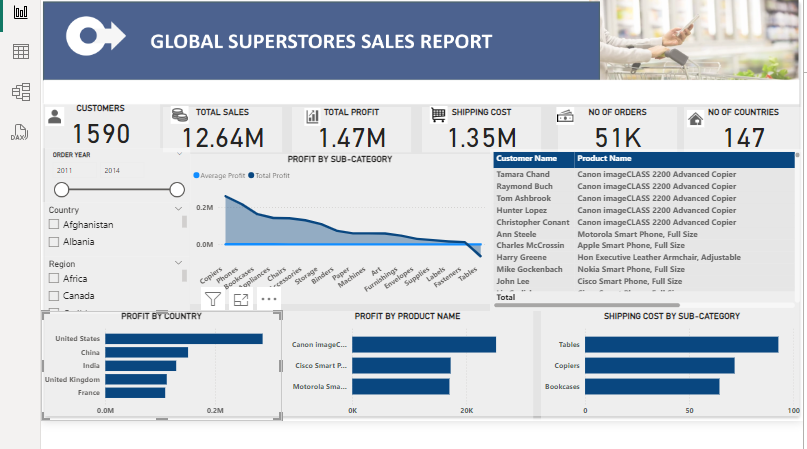                                          |  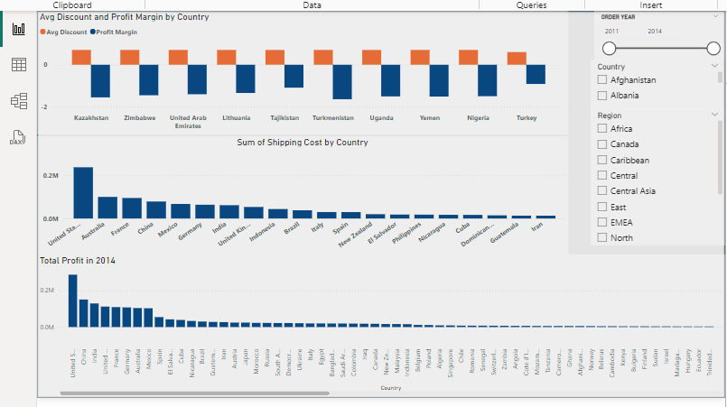

This is an overview dashboard of the Global Superstores sales data. For more information, kindly reach out to me.

## Analysis
### Top 3 countries and most profitable products by total profit in 2024: 

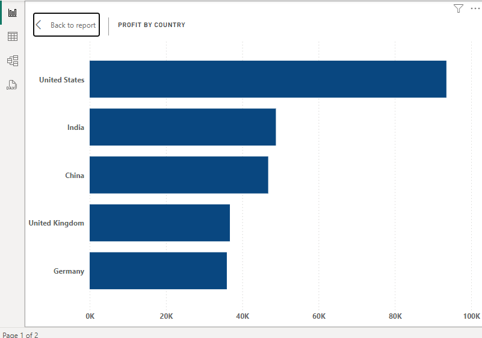  
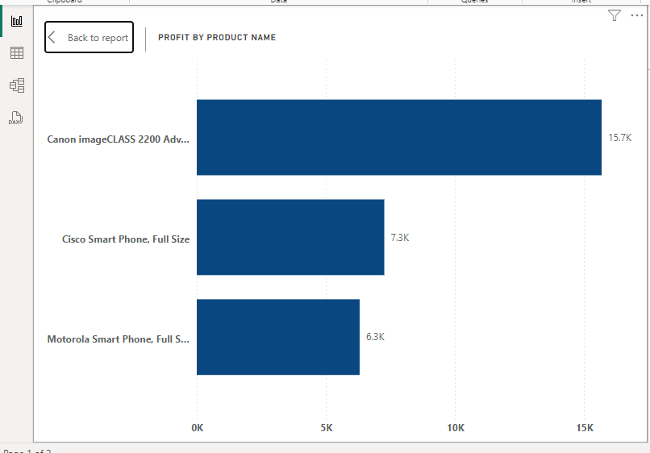 

The three countries that generated the highest total profit in 2014 are *United States*,*India* and *China*. The image above shows the top 3 profitable products in the United States.

### The subcategories with the highest average shipping costs in the United States and their impact on profitability:

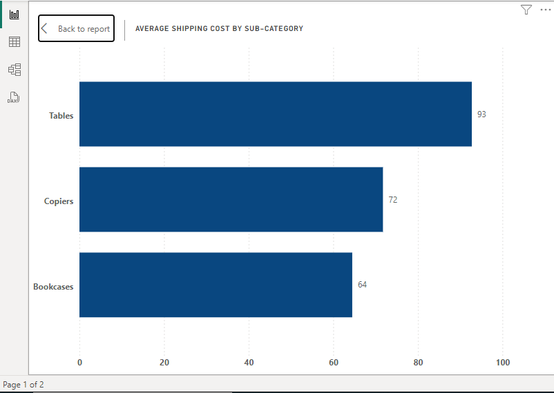 
The three subcategories with the highest average shipping cost in the United States are: *Tables*, *Copiers*, and *Bookcases*. By understanding these costs, we can identify areas for potential cost optimization to enhance overall profit margins.

### Nigeria's 2014 profit with other African countries and analyze factors such as shipping costs and discounts that affect its performance:

 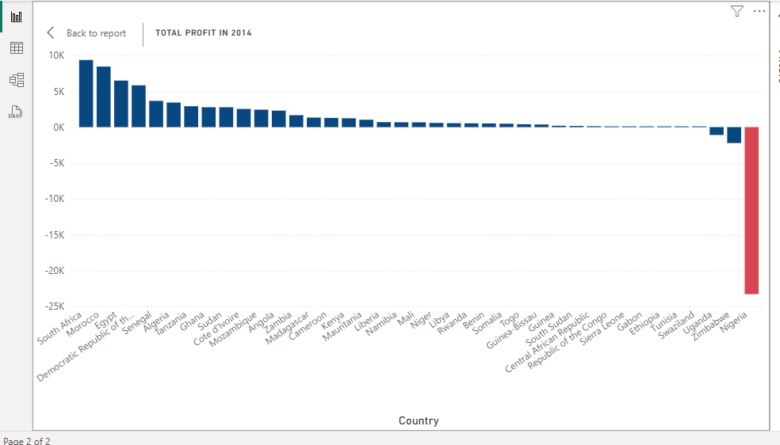
 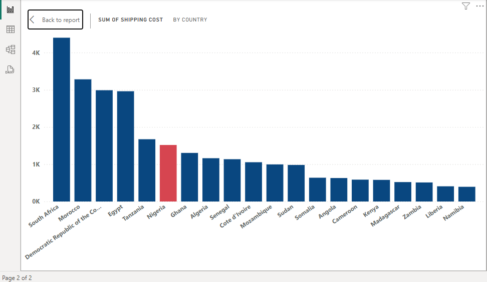
 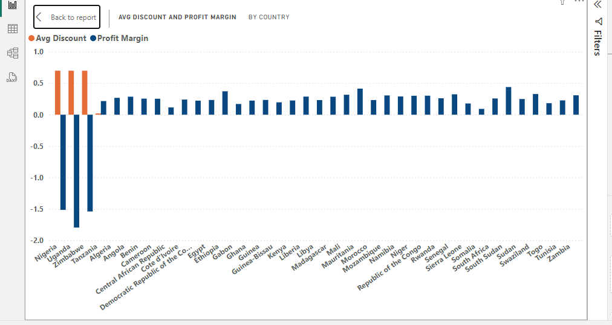

 Nigeria’s total profit in 2014 was significantly lower compared to other African countries like South Africa and Morocco. Shipping costs in Nigeria are higher compared to other African countries, reducing overall profitability. A higher average discount rate reduces the profit margin for products sold in Nigeria.

### The least profitable product subcategory in Southeast Asia and assess whether it should be discontinued in specific countrieS:

 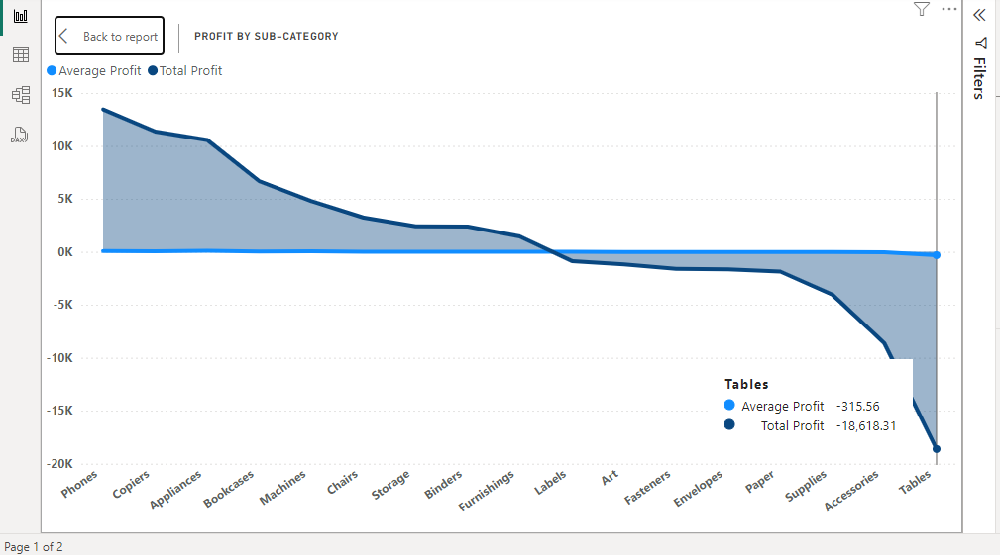
  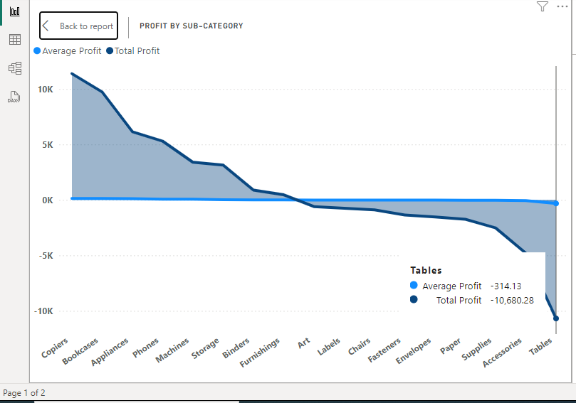

  The least profitable product subcategory in Southeast Asia is Tables. Global Superstore should consider discontinuing the Tables subcategory in Indonesia, where it has shown consistently low profitability and negative returns of -10,680 out of the -18,618 loss from Tables.

### The most valuable customers and what do they purchase:

  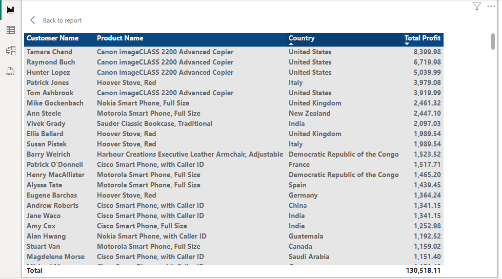

The most valuable customers are those who generate the highest total profit. They typically purchase high-margin items such as Canon imageCLASS 2200 Advanced Copiers.

# Conclusion
The analysis of the Global Superstore dataset provides critical insights into sales performance, profitability, and operational efficiencies across various regions and product lines. Addressing identified areas for improvement, such as optimizing shipping costs and adjusting product mix in low-profit regions, will enhance overall business performance.

  

  

     

 
